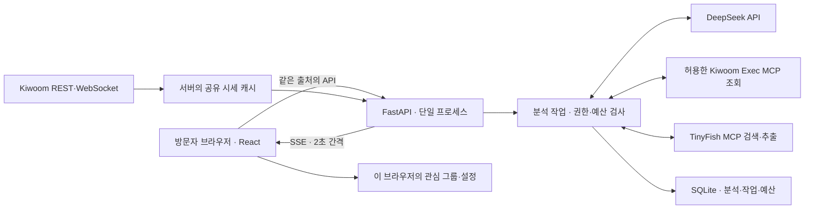

# 현재 구현을 검수하는 방법

2026-09-16 기준. 이 문서는 `/`의 기존 API 연결 화면과 서버를 설명한다. 새 `/original` 화면은 원본 HTML을 재현한 예시 데이터 앱으로, 아래 API와 아직 매핑하지 않았다. 새 화면의 모델·보안·검증은 [원본 재현 기록](ORIGINAL_REPRODUCTION.md)에 있다. `private/demo-spec/DESIGN.md`의 전체 제품 모델은 목표 설계이며, 아직 모든 필드·수집기·화면 상태가 구현된 것은 아니다. 실제 실행 증거는 [검증 기록](VERIFICATION.md)에 있다.

## 실행 위치와 데이터 흐름

브라우저는 화면을 그리고 서버에 자료를 요청한다. 서버가 키움 연결을 유지하므로 같은 ETF를 보는 방문자가 늘어도 방문자마다 키움 연결을 만들지 않는다. 현재 브라우저 SSE 연결 상한은 40개다. 대규모 접속 성능을 검증한 구조는 아니다.

DeepSeek는 호출할 도구를 제안한다. 실제 실행은 서버가 결정하며, 서버 코드가 도구 이름·인자·현재 ETF·출처·남은 한도를 검사한다. 가격 계산·요청 경로·재시도는 코드가 처리한다. 지금 실행 중인 DEMO 모드에서는 외부 금융·LLM 호출 없이 명시된 예시를 제공한다.

## 페이지가 실제로 읽는 모델

정확한 TypeScript 필드는 [domain.ts](src/domain.ts), 응답 생성은 [app.py](server/app.py)와 [data.py](server/data.py)에 있다.

| 화면 | 현재 모델 | 저장 위치·주의점 |
|---|---|---|
| 온보딩·설정 | `Preferences`: 선택 테마, 이름, 완료 여부 | 브라우저 localStorage. 로그인 없이 해당 브라우저에 보존 |
| 홈·관심·검색 | `Catalog.instruments` + `Preferences.groups` | 시세는 서버 공통 캐시, 그룹과 순서는 브라우저. 여러 탭은 마지막 저장 우선 |
| ETF 오늘 움직임 | `Instrument.quote`, `Candle[]` | 현재가와 수정 일봉의 시점을 구분. 오늘 일봉은 완료 봉 계산에서 제외 |
| ETF AI 분석 | `Analysis[]`, `Factor[]`, `Source[]` | DEMO는 고정 예시. REAL은 SQLite에 성공한 분석만 저장. 모델·분석 시각과 시세 시각을 구분 |
| ETF 종목정보 | `Holding[]`, 잔여 비중, 기준일, 기본 정보 | 실제 운용사 수집기는 미구현. REAL은 빈 구성과 자료 없음 |
| 탐색·테마 | 종목 목록 + 테마 분류 | 현재 분류는 편집한 메타데이터. 실제 편입 비중·예측 순위라는 뜻이 아님 |
| 이슈 | 선택 ETF의 최근 분석·출처 | 독립 뉴스 수집기·뉴스 DB는 미구현. DEMO는 예시, REAL은 성공한 분석이 없으면 빈 상태 |

금액·OHLC·등락 비율은 API에서 decimal 문자열이다. 거래량은 정수, 구성 비중은 현재 데모에서 숫자다. `dataMode`는 묶음/분석의 `DEMO` 또는 `REAL`, 자료 상태는 `READY / STALE / MISSING / ERROR / UNSUPPORTED`로 표현한다. 최초 설계의 모든 자료에 공통 `Observation`을 적용하는 작업은 아직 하지 않았다.

핵심 계산은 사용자가 직접 검산할 수 있다.

- 등락률: `r = P / P_previous − 1`. 전일 100, 현재 103이면 `r=0.03`, 화면에는 `+3.00%`.
- 관심 그룹: `r_group = (r₁ + … + rₙ) / n`. 단순 평균이며 보유 금액은 입력받지 않는다. 필요한 시세가 없으면 숫자를 만들어 평균내지 않는다.
- MA20: 완료된 최근 종가 20개의 평균. 20일 수익률은 `C_t / C_(t−20) − 1`이므로 종가 21개가 필요하다.
- 미확인 비중: `w_missing = 1 − Σw_known`. 알려진 비중이 60%, 30%라면 미확인 10%를 남긴다.
- 자료 부족은 `null` 또는 `MISSING`. 0% 수익률이나 중립 전망으로 바꾸지 않는다. 전망 점수 정책은 미확정이므로 현재 전망은 판단 보류다.

## 현재 API와 작업 상태

| API | 역할 |
|---|---|
| `GET /api/health` | 서버 상태·DEMO/REAL·버전 |
| `GET /api/catalog` | 대상 ETF와 현재 시세, 연결 상태, 분석 요청 가능 여부 |
| `GET /api/etfs/{symbol}` | ETF 상세·일봉·구성·저장된 분석 |
| `GET /api/quotes/stream` | 공유 시세를 SSE로 전달 |
| `POST /api/analysis-jobs` | `{ "instrumentId": "396500" }`만 받아 분석 요청 |
| `GET /api/analysis-jobs/{id}` | 작업 상태·실패 코드 조회 |

그룹·검색·테마별로 별도 API를 늘리지 않고 카탈로그와 브라우저 상태에서 계산한다. 현재 작업 상태는 `RUNNING → SUCCEEDED 또는 FAILED`다. 시간 초과는 `FAILED`와 `failureCode=TIMED_OUT`으로 기록한다. 대기열은 없으며 동시 2개를 넘는 새 작업을 거절한다. 동일 종목·한국 시간 달력 날짜·정책의 실행 중/성공 작업은 재사용한다.

초기 설계와 남은 차이: 보안 미들웨어 오류는 `{error:{code,message,requestId}}`, FastAPI의 HTTP/입력 검증 오류는 `{detail:…}`다. 프런트엔드는 두 형식을 처리한다. 오류 형식 통일, 원자료 스냅샷 보존과 모든 출처의 `contentHash` 추적은 아직 미완료다.

## 검수할 보안 경계와 다음 통과 조건

| 경계 | 구현된 제어 | 아직 필요한 실제 증거 |
|---|---|---|
| 공개 브라우저 → 서버 | 동일 출처 쓰기·JSON 입력 크기 제한·서명 쿠키·세션/IP 한도·텍스트 렌더링 | 공개 HTTPS·프록시 IP 신뢰 설정·배포 상태에서 악성 입력과 정상 입력 대조 |
| 서버 → Kiwoom | 키는 서버 환경에만 설정. ETF 허용 목록·고정 REST 경로·단일 토큰 갱신·공통 조회 간격·WS 재연결 | 실제 인증, 장중 체결, 만료·무체결·휴장·재구독, 수신→화면 지연 |
| DeepSeek → 도구 실행 | 현재 ETF 시세와 제한된 공식 출처 검색/추출만 노출. 주문·계좌·임의 명령은 거부 | 실제 DeepSeek 및 두 MCP 왕복, 악성 문서를 넣어도 허용 범위 유지 |
| TinyFish → 출처 | 발견된 허용 HTTPS 도메인, 내부 주소 거부, 사전 리다이렉트와 응답 최종 URL 검사 | 원격 제공자의 실제 DNS/리다이렉트 처리까지 포괄하는 통합 검증 |
| 생성 결과 → 화면 | JSON·출처 ID·인용 대조, 생성 문구의 숫자 거부. 금융 지표는 코드 계산 | 근거 구절이 실제 주장을 뒷받침하는지 별도 검수. 인용 일치만으로 사실성 통과 판정 금지 |
| 분석 요청 → 비용 | 최대 3회 모델 호출·6회 도구·60초·동시 2개. SQLite에 일간 예약 예산 기록 | 모델 요금에 맞춘 금액 예산, 재시작 인증과 실제 제공자 사용량 대조 |

로컬 검사가 통과한 범위와 미실행 항목을 구분한 뒤, 실제 API 연결 → 운용사·뉴스 수집 및 분석 정책 → 배포·외부 검증 순으로 완료해야 공개 데모 조건을 충족한다. 개인의 이해도는 AI가 만든 코드나 통과한 테스트 수로 채점하지 않는다. 사용자가 위 데이터 흐름이나 한 계산을 자신의 수식 또는 중학생 대상 설명으로 검수한 관찰을 별도로 기록한다.
