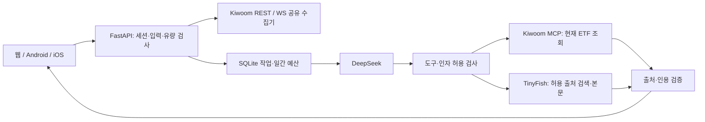

# API 입력 전 검수와 전환 순서

완료 범위는 원본 기반 체험 앱, 서버 연결 코드, 네이티브 패키징, 키 없는 공개 데모다. 키 입력 전에는 실제 금융·AI 인증 성공을 검증할 수 없다. 커뮤니티는 예시와 기기 저장이며 방문자 간 게시판이 아니다. 실제 통과 여부는 [VERIFICATION.md](VERIFICATION.md)를 확인한다.

## 페이지 데이터 모델

| 화면 | 입력 | 검수 조건 |
|---|---|---|
| 온보딩·관심·그룹 | `watch`, `themeWatch`, `wGroupList` | 새로고침 후 선택 유지. 저장 실패 표시 |
| 홈·검색·ETF 가격 | `Catalog → Instrument → Quote` | 내부 키와 6자리 종목코드 대응. 값·등락·시각이 API와 동일 |
| 오늘 움직임 | `Candle[]` | 날짜 오름차순·중복 없음·OHLC 정상. 완료 봉만 지표 계산 |
| 구성·히트맵 | `Holding[]`, `residualWeight`, `holdingsAsOf` | 확인·미확인 비중 합계 100%. 없는 등락은 회색·값 없음 |
| 기본 정보 | `fundamentals[]` | 원자료 없으면 자료 없음 |
| 연결된 분석 | `Analysis[]`, `Factor[]`, `Source[]` | 날짜별 스냅샷·지표·출처. 없는 분석은 판단 보류 |
| ETF AI | `ChatRequest → Job → response` | ETF 범위 고정. 처리 중/실패 표시. 다른 세션의 결과는 404 |
| 커뮤니티 | `commMine`, `postReplies`, `commLikes`, `pollVotes`, 프로필 | 작성·댓글·리포스트·투표·프로필 저장, 글 삭제, 방문자 격리 |
| 원본 탐색·뉴스·스토리 | 원본 편집 자료 | 예시 표시. 실제 뉴스 수집·투자 전망으로 취급하지 않음 |

금액·OHLC·등락 비율은 decimal 문자열, 비중은 0~1 숫자다. `DEMO/REAL`은 자료 모드, `READY/STALE/MISSING/ERROR/UNSUPPORTED`는 상태다. REAL 연결 실패 후 DEMO로 자동 전환하지 않는다.

## 수학적 조건

- 등락률: `r = P / P_previous − 1`. 100에서 103이면 화면 `+3.00%`. 값이 없거나 분모가 0이면 `—`.
- 관심 그룹: 선택한 그룹의 단순 평균 `r_group = Σr_i / n`. +3%, −1%이면 +1%. 하나라도 값이 없거나 빈 그룹이면 `—`, 두 값의 합이 0이면 `0.00%`.
- 이동평균: 완료된 최근 종가 20개에 대해 `MA20 = ΣC / 20`. 19개면 자료 없음. 미완료 봉을 더해도 MA20이 바뀌지 않아야 한다.
- 20거래일 수익률: `C_t / C_(t−20) − 1`. 종가 21개가 필요하다.
- 구성: `Σw_known + w_missing = 1`. 반도체 ETF의 예시 비중은 확인 72.99%, 미확인 27.01%다. 히트맵 면적도 이를 따른다.
- 출처: 생성 주장마다 존재하는 `sourceId`와 원문에 포함되는 인용이 있어야 한다. 인용 존재는 검증하지만 의미상 정확성을 자동 증명하지는 않는다.

## 연결과 보안

키는 서버 환경에만 있다. 모델에는 `get_quote`, `search_sources`, `fetch_source`만 노출한다. 명령 경로·종목·모드·프로필은 서버가 결정한다. 주문·계좌 API는 없다. TinyFish는 검색에서 발견한 허용 HTTPS 출처만 받으며 사설 주소·비허용 최종 URL을 거부한다.

방문자는 서명 쿠키로 구분한다. 10분당 분석 요청은 세션 2회·IP 6회, 대화는 세션 6회·IP 12회다. 최대 동시 작업 2개, 작업 60초, 모델 3회·도구 6회다. 작업당 80,000토큰을 보수적으로 예약하고 실패해도 반환하지 않는다. 실제 과금액과는 다른 제한용 예약량이다. SQLite에 기록해 재시작 후에도 예산을 유지한다.

숫자 지표·라우팅·재시도는 코드가 처리한다. 모델은 근거 요약과 설명을 맡는다. 같은 날짜의 성공한 ETF 분석은 재사용한다. 대화 결과는 세션별로 저장하고 공개 ETF 이력에 섞지 않는다.

## API 입력 순서

1. 단일 서버 프로세스·영구 `data/` 볼륨·HTTPS·등록 가능한 송신 IP를 준비한다. 로컬 Docker는 구현되어 있다. Render 공유 IP 대역과 전용 IP는 다르다.
2. `.env.example`을 서버 `.env`로 복사하거나 호스팅 비밀 변수로 입력한다. 확인 전까지 `EDGE_MODE=demo`를 유지한다.
3. `KIWOOM_APP_KEY`, `KIWOOM_APP_SECRET`에 실전 조회용 REST 키를 입력하고 서버 송신 IP를 개발자센터에 등록한다.
4. `DEEPSEEK_API_KEY`, `DEEPSEEK_MODEL`, `TINYFISH_MCP_TOKEN`을 입력한다. Codex 도구의 인증은 이 앱에 자동 이전되지 않는다.
5. Docker는 공식 MCP를 설치하므로 `KIWOOM_MCP_COMMAND=kiwoom-exec-mcp`, `KIWOOM_MCP_ARGS=[]`를 사용한다. 로컬에서는 공식 `mcp_exec` 설치 경로를 지정한다.
6. `EDGE_DAILY_TOKEN_BUDGET`을 정한다. 기본 0이면 분석 비활성화, 80,000이면 한 작업의 예약량이다.
7. `python -m server.preflight --require-live`를 실행한다. 비밀 값은 출력하지 않고 누락·오류만 알려준다. 외부 인증은 하지 않는다.
8. 공개 시세 재제공 권한과 송신 IP를 확인한 후 `EDGE_MODE=live`로 전환한다. 공개 서버는 `EDGE_MARKET_DATA_PUBLIC_USE_CONFIRMED=1`도 필요하다.
9. 토큰·ETF 목록·장중 체결·만료·재연결을 확인한다. 제한된 예산으로 질문과 분석을 한 번씩 실행하고 출처 원문과 결과를 대조한다. 실패 시 키·원본 공급자 응답을 로그에 출력하지 않는다.

운영 웹은 FastAPI가 같은 출처에서 제공하므로 서버 모드만 바꾸면 된다. 기본 모바일 앱은 오프라인 번들이므로 `EDGE_API_ORIGIN=https://서버주소`로 다시 빌드한다. 키가 아닌 서버 주소만 포함한다. 모바일은 10초 간격 조회, 웹은 SSE로 시세를 받는다.

Docker Compose 2.24 이상에서는 앱 폴더의 `.env`를 런타임에 읽는다. `.env.example`의 `EDGE_PUBLIC_ORIGIN`을 실제 서버 주소로 수정한다(로컬 Docker는 `http://127.0.0.1:8025`). 변경 후 `docker compose up -d --force-recreate`, 구성 점검은 `docker compose exec edge python -m server.preflight --require-live`다. 키 없이 실행할 때는 `.env`가 없어도 된다. [Compose 환경 파일 규칙](https://docs.docker.com/reference/compose-file/services/#env_file).

Sites 공개 데모는 계속 예시 자료를 제공한다. 여기서 Python·stdio MCP가 실행되는 것으로 가정하면 안 된다. 금융 서버의 호스팅 계정, iOS 배포 서명·스토어 계정은 API 키와 별도 조건이다.

## 모바일 파일 확인

최종 파일은 [VERIFICATION.md](VERIFICATION.md)의 설치 파일 링크에서 연다. Android APK는 Android 기기로 옮겨 설치하거나 개발 환경에서 `adb install EDGE-demo-android.apk`로 설치한다. 개발 서명본이므로 스토어 출시본과 구분한다.

macOS에서는 시뮬레이터 압축을 별도 폴더에 풀고 Simulator를 켠 뒤 `xcrun simctl install booted App.app`, `xcrun simctl launch booted com.marketbrew.edge`로 실행한다. iPhone용 unsigned 파일은 Apple 개발 서명·프로비저닝을 적용하기 전에는 휴대폰 설치 파일이 아니다.

## 사용자 검수와 이해도

온보딩 → ETF 선택 → 검색 → 오늘 움직임 → 연결된 분석·출처 → 날짜 변경 → ETF AI 질문 → 커뮤니티 투표 → 글·댓글·리포스트 → 프로필 변경 → 새로고침 → 글 삭제를 확인한다. 다른 브라우저에서는 내 글이 없어야 한다.

AI가 만든 코드나 테스트 수로 사용자의 이해도를 채점하지 않는다. 다음을 본인의 수식과 입력·출력으로 명료하게 기술하거나, 필요한 용어를 아는 중학생에게 설명하면 이번 구조의 도달 조건을 충족한다.

**가격이 100에서 103으로 바뀔 때 Kiwoom·서버·화면·DeepSeek는 각각 무엇을 맡으며, 연결이 끊기면 왜 예시 가격으로 바꾸면 안 되는가?**

직접 설명을 관찰하기 전까지 이해도는 미평가다.
